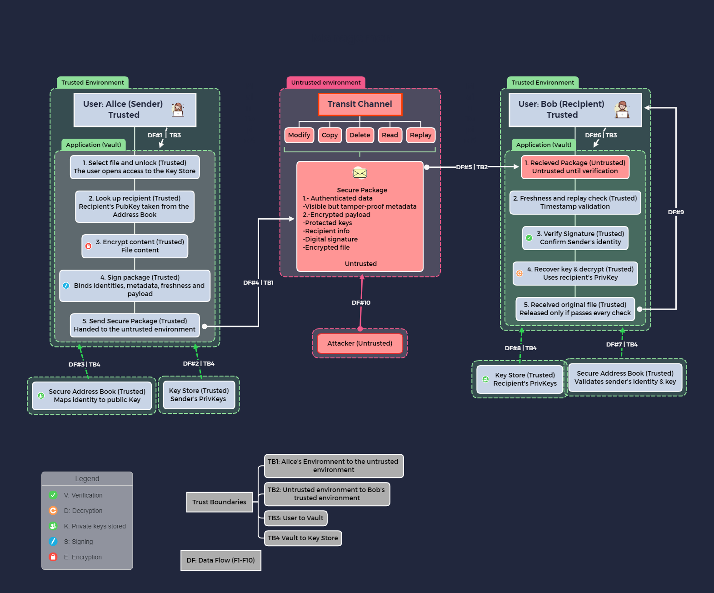

# D1: Architecture & Threat Model

### Secure File Exchange Platform (Secure Digital Document Vault)

**Universidad Nacional Autónoma de México · Facultad de Ingeniería**

Criptografía · Semester 2027-1 · Group 04

Teacher: Dra. Rocío Alejandra Aldeco Pérez · Delivery date: 26/09/2026

**Team 05:** 
· Arroyo Ramírez Carlos Alberto 
· Escudero Bohórquez Julio 
· Martínez Miranda Juan Carlos 
· Pérez Avin Paola Celina de Jesús 
· Salgado Miranda Jorge

---
## 1. System Overview

**The problem:** Two people who do not share a trusted network need to exchange a file. The file travels through, and may sit in, places neither of them controls: a network path, a shared folder, a remote storage service. 
The platform (the Vault, from here on) exists to make that not matter: Bob should be able to read what Alice sent, notice if anything was changed along the way, and be sure it actually came from her. All three guarantees have to hold no matter how the channel or the storage in between behaves.

**Core features**

1. Protect a file for one named recipient: the content is encrypted, and the key that protects it is packaged so that only that recipient can recover it.
2. Sign the result so that sender, recipient, metadata and payload are bound together in a single Secure Package (the encrypted file container).
3. Keep each user's private keys in a Key Store inside their trusted environment and never leaves it.
4. Resolve identities to public keys through a Secure Address Book, both when choosing a recipient and when checking who sent a package.
5. Treat every incoming package as untrusted: check freshness, verify the signature, and only then recover the key and decrypt. Any failed check ends in a refusal with no output.

**Explicitly out of scope.**

- *Availability.* An attacker who controls the channel can delete or block a package. Nothing here guarantees delivery.
- *Compromised endpoints.* If Alice's or Bob's device already has malware on it, or is stolen while unlocked, none of this helps. Trusted environments are assumed to stay trustworthy while in use.
- *Content safety.* The platform can tell Bob that a file really came from Alice and wasn't altered. It cannot tell if the file is harmless.
- *What happens after decryption.* Once Bob has the plaintext, he could copy it, forward it, or leak it, and the architecture has no say in that.
- *Traffic analysis.* Who talks to whom, how often, and roughly how much isn't hidden beyond the minimum that the visible metadata already allows.
- *Key lifecycle.* Revocation, rotation, recovery, and how public keys get enrolled in the first place along with what happens to old packages if a long-term key is later exposed are left as open questions.

--- 
## 2. Architecture Diagram

The diagram follows the package from left to right. On Alice's side, the vault picks up the chosen file, looks up for Bob's public key, encrypts the content and signs the whole thing using the private key stored in the Key Store.
The Secure Package then crosses into the untrusted zone, where we assume the attacker can act on it.
On Bob's side, the package arrives and is treated as an untrusted input, once the vault checks freshness and verifies the signature against Alice's public key from the Address Book, it recovers the key and decrypt with Bob's private key. 
Only then is the file released to Bob. 
